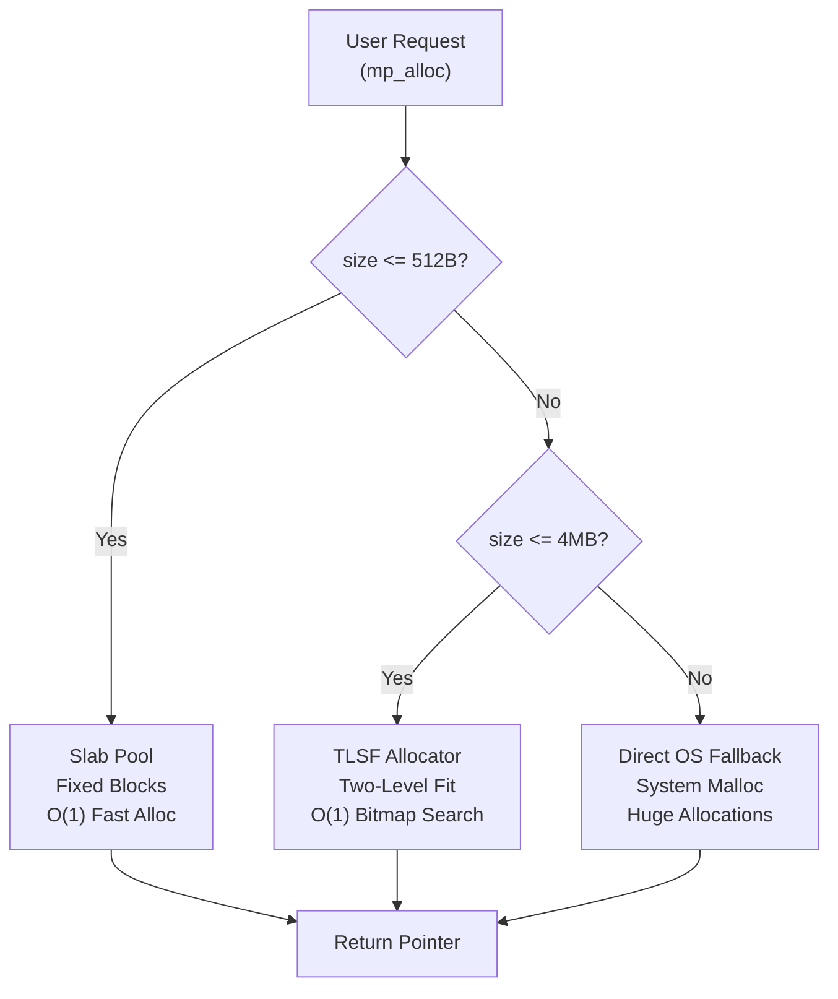
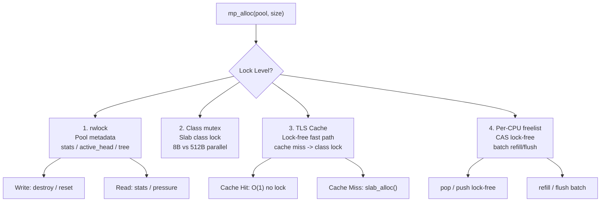
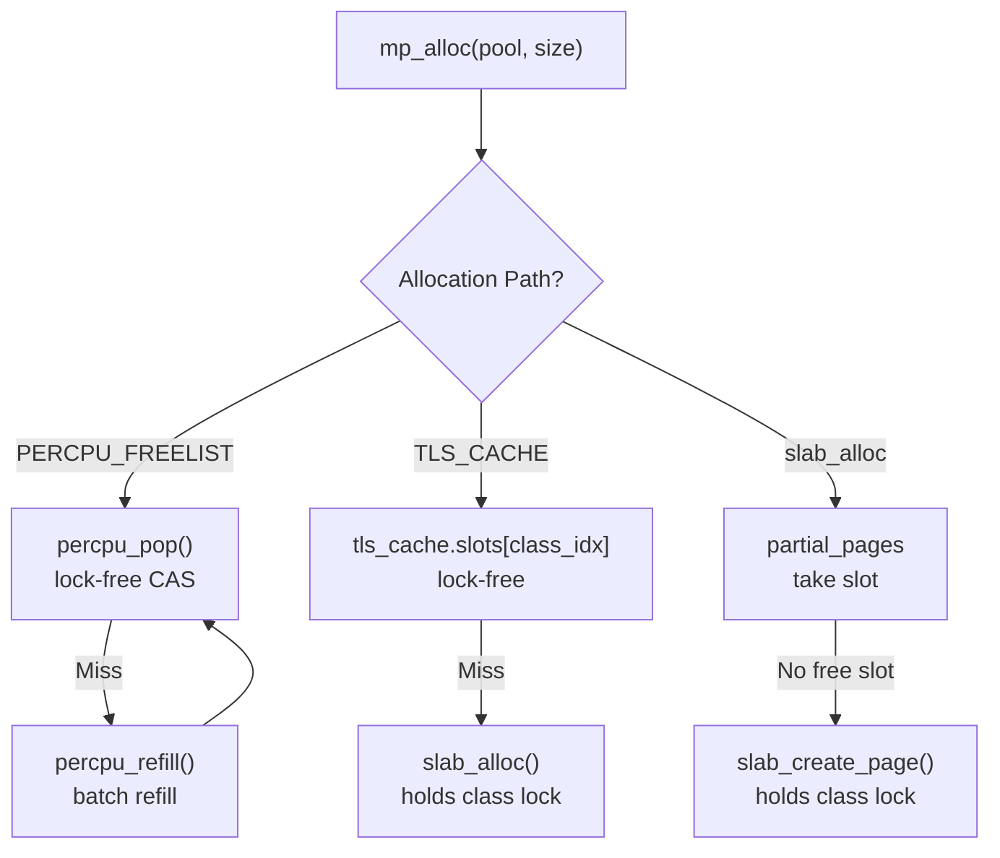
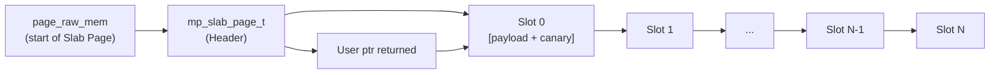
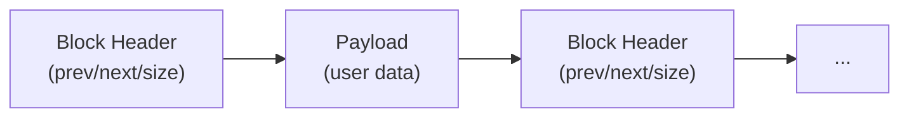
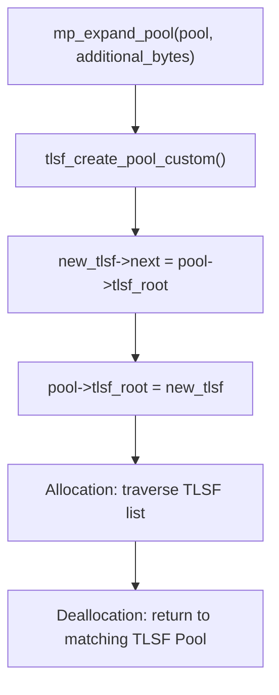

# cmem Architecture Design Document

## 1. System Overview

cmem is a general-purpose high-performance hierarchical memory manager that adopts a **Tiered Hybrid Architecture**, achieving $O(1)$ allocation time complexity while significantly reducing memory fragmentation and improving Cache locality.

### 1.1 Design Goals

- **High Performance**: $O(1)$ constant-time allocation/deallocation for small objects
- **Low Fragmentation**: Slab + TLSF hybrid strategy to reduce memory fragmentation
- **High Concurrency**: Multi-thread-safe access, Per-CPU lock-free fast path
- **Observability**: Built-in comprehensive diagnostics, monitoring, and leak detection
- **Easy Integration**: Provides C11, C++17, PMR multi-language interfaces

### 1.2 Core Architecture



```text
                            +-------------------------------+
                            |   User Request (mp_alloc)    |
                            +-------------------------------+
                                            |
                     +----------------------+----------------------+
                     | (<= 512 Bytes)       | (512B ~ 4MB)         | (> 4MB)
                     v                      v                      v
            +------------------+   +-------------------+   +--------------------+
            |   Slab Pool      |   |   TLSF Allocator  |   | Direct OS Fallback |
            | (Fixed Blocks)   |   | (Two-Level Fit)   |   |  (System Malloc)   |
            +------------------+   +-------------------+   +--------------------+
            | O(1) Fast Alloc  |   | O(1) Bitmap Search|   | Huge Allocations   |
            | Zero Extra Frag  |   | Immediate Merge   |   | Dynamic Page Track |
            +------------------+   +-------------------+   +--------------------+
            ```

---

## 2. Three-Tier Allocator Details

### 2.1 Slab Allocator (Tier 1: <= 512B)

A fixed-size Class allocator for small objects, providing $O(1)$ allocation/deallocation.

**Core Features:**
- Predefined size classes: 8B, 16B, 32B, 64B, 128B, 256B, 512B
- Each Class has an independent lock, reducing lock contention
- Supports Thread-Local Cache (TLS Cache) for lock-free fast path with automatic POSIX thread-exit cleanup (`pthread_key`)
- Retains empty slab pages in `empty_pages` list to avoid mid-free `munmap` overhead and prevent use-after-free
- Supports Per-CPU Lock-Free Freelist to further reduce concurrency overhead

**Data Structures:**

```c
typedef struct mp_slab_page {
    uint8_t class_index;        // Slab Class index this page belongs to
    uint16_t free_count;        // Current number of free slots
    uint16_t total_slots;       // Total number of slots
    mp_slab_slot_t* free_list;  // Free slot linked list
    struct mp_slab_page* next;  // Linked list pointer
    struct mp_slab_page* prev;  // Doubly-linked list prev
    void* page_raw_mem;         // Raw page memory pointer
    bool is_hot;                  // Hot/Cold page separation flag
} mp_slab_page_t;

typedef struct {
    size_t slot_size;           // Slot size for this Class
    pthread_mutex_t lock;       // Fine-grained class lock
    mp_slab_page_t* partial_pages;  // Partially used pages
    mp_slab_page_t* full_pages;     // Fully occupied pages
    mp_slab_page_t* hot_pages;      // Hot page list (Hot/Cold separation)
    mp_slab_page_t* cold_pages;     // Cold page list (Hot/Cold separation)
} mp_slab_class_t;
```

**Allocation Flow:**
1. Match the request size to the closest Slab Class
2. Prefer taking a free slot from the head of `partial_pages` list
3. If no free slots, create a new Slab Page
4. If TLS Cache is enabled, allocate from thread-local cache first
5. If Per-CPU Freelist is enabled, allocate from per-CPU freelist first

### 2.2 TLSF Allocator (Tier 2: 512B ~ 4MB)

A Two-Level Segregated Fit allocator with dual-level bitmap indexing, providing $O(1)$ lookup.

**Core Features:**
- First-level bitmap (FL): 32 regions, each covering a specific size range
- Second-level bitmap (SL): Each FL maps to 64 SLs, totaling 2048 size classes
- Supports In-Place Expansion, avoiding memcpy
- Automatically merges adjacent free blocks, reducing fragmentation
- **Per-Thread TLSF Free-Block Cache**: Thread-local cache (`tls_cache.tlsf_slots/counts`) enables lock-free hot-path allocations, bypassing the TLSF global lock entirely for frequently-requested sizes

**Data Structures:**

```c
typedef struct tlsf_pool {
    uint32_t fl_bitmap;                    // First-level bitmap
    uint32_t sl_bitmap[TLSF_FL_MAX];       // Second-level bitmap array
    tlsf_block_t* blocks[TLSF_FL_MAX][TLSF_SL_COUNT];  // Free block matrix
    void* raw_area;                        // Raw memory area
    size_t raw_size;                       // Raw memory size
    struct tlsf_pool* next;                // Linked list pointer (supports online expansion)
} tlsf_pool_t;
```

**Mapping Function:**
```
size -> (fl, sl)
  fl = log2(size) - LOG2_MIN_SIZE
  sl = (size >> (fl + LOG2_MIN_SIZE)) - 1
```

### 2.3 Direct OS Fallback (Tier 3: > 4MB)

Large objects directly fall back to system allocation, supporting:
- Guard Pages protection (PROT_NONE at page head/tail)
- HugePages acceleration (2MB/1GB)
- Custom system allocator injection

---

## 3. Core Data Structures

### 3.1 Memory Pool Main Structure

```c
struct memory_pool {
    mp_flags_t flags;                    // Configuration flags
    pthread_rwlock_t rwlock;             // Read-write lock (thread-safe mode)
    pthread_mutex_t lock;                // Write lock
    char arena_name[64];                 // Arena name

    // Parent-child hierarchy tree
    struct memory_pool* parent;          // Parent Arena
    struct memory_pool* first_child;     // First child Arena
    struct memory_pool* next_sibling;    // Next sibling Arena

    // Custom system allocator
    bool has_custom_sys_alloc;
    mp_sys_allocator_t sys_allocator;

    // Event callbacks
    mp_event_callback_t event_cb;
    void* event_user_data;

    // Watermark alerts
    mp_watermark_callback_t watermark_cb;
    double high_watermark_ratio;
    double low_watermark_ratio;
    bool in_high_watermark_state;
    void* watermark_user_data;

    // NUMA affinity
    int numa_node;

    // Emergency reserve
    void* emergency_buf;
    size_t emergency_size;
    size_t emergency_used;
    bool in_emergency_state;

    // Statistics and diagnostics
    mp_stats_t stats;
    mp_block_header_t* active_head;      // Active allocation linked list
    uint64_t window_alloc_ops;           // Allocation count in window period
    uint64_t window_alloc_bytes;         // Allocation bytes in window period
    struct timespec window_start_time;   // Window start time

    // Slab layer
    mp_slab_class_t slab_classes[SLAB_CLASS_COUNT];

    // TLSF layer
    tlsf_pool_t* tlsf_root;

    // Runtime enhancement fields
    uint64_t env_flags_generation;       // Environment config generation counter
    bool auto_compact_enabled;           // Auto-compact toggle
    double auto_compact_pressure_threshold;
    double auto_compact_fragmentation_threshold;
    struct timespec last_auto_compact_time;
    size_t alloc_latency_histogram[32];  // Latency histogram
    size_t alloc_latency_count;
    uint64_t alloc_latency_sum_ns;
    size_t arena_quota_limit;            // Arena quota
    mp_watermark_callback_t arena_quota_cb;
    void* arena_quota_user_data;
    int num_cpus;                        // Per-CPU freelist CPU count
    mp_percpu_freelist_entry_t* percpu_freelists;
    mp_watermark_callback_t gc_cb;       // GC callback
    void* gc_user_data;
    mp_watermark_callback_t eviction_cb; // Eviction callback
    void* eviction_user_data;
    bool fallback_to_sys_alloc_on_oom;   // OOM fallback toggle
    bool is_dirty;                       // Dirty pool flag
    mp_watermark_callback_t error_recovery_cb;
    void* error_recovery_user_data;
    size_t thread_quota_bytes;           // Thread quota
    bool circuit_breaker_enabled;        // Circuit breaker toggle
    bool circuit_breaker_tripped;        // Circuit breaker tripped state
    uint32_t abi_version;                // ABI version
    bool cgroup_aware;                   // cgroup awareness toggle
    size_t cgroup_mem_limit;             // cgroup memory limit
    bool use_custom_slab_sizes;          // Custom Slab table toggle
    size_t custom_slab_sizes[SLAB_CLASS_COUNT]; // Custom Slab sizes
};
```

### 3.2 Block Header Structure

A prepended header on each allocated block, used for debugging, tracking, and deallocation:

```c
typedef struct mp_block_header {
    uint32_t magic;                     // Magic number: MP_MAGIC_HEAD / MP_MAGIC_FREE
    uint8_t alloc_type;                 // Allocation type: SLAB / TLSF / OS
    uint8_t slab_class;                   // Slab Class index
    uint8_t flags;                      // Block flags
    uint8_t canary;                     // Canary byte (debug mode)
    size_t requested_size;              // User-requested size
    size_t usable_size;                 // Actual usable size
    void* raw_base;                     // Raw base address
    const char* alloc_file;             // Allocation file (location tracking)
    int alloc_line;                     // Allocation line number
    const char* alloc_func;             // Allocation function
    void* backtrace_addrs[MAX_BACKTRACE_FRAMES];
    int backtrace_depth;
    struct mp_block_header* prev;       // Doubly-linked list
    struct mp_block_header* next;
} mp_block_header_t;
```

### 3.3 Thread-Local Cache

```c
typedef struct {
    mp_slab_slot_t* slots[SLAB_CLASS_COUNT];  // Cached slots per Class
    uint16_t counts[SLAB_CLASS_COUNT];         // Cache count per Class
} thread_cache_t;

static MP_THREAD_LOCAL thread_cache_t tls_cache = {{0}, {0}};
```

---

## 4. Concurrency Control Model

### 4.1 Lock Hierarchy Strategy

cmem adopts a **multi-level lock strategy**, from coarse to fine:



1. **Read-Write Lock (rwlock)**: Protects pool-level metadata (stats, active_head, tree structure)
   - Read lock: Introspection query APIs (mp_get_stats, mp_pressure, etc.)
   - Write lock: Lifecycle operations (mp_destroy, mp_reset)

2. **Fine-Grained Slab Class Locks**: Each Slab Class has an independent `pthread_mutex_t`
   - Small object allocations of different sizes do not interfere with each other
   - 8B and 512B allocations can be fully parallel

3. **Thread-Local Cache (TLS Cache)**: Completely lock-free
   - Small object allocations prefer the TLS Cache path
   - Falls back to locked path only on Cache Miss

4. **Per-CPU Lock-Free Freelist** (optional)
   - CAS-based per-CPU freelist
   - Completely lock-free, no false sharing
   - Batch Refill/Flush mechanism to maintain memory utilization

### 4.2 Lock-Free Path



```
mp_alloc(pool, size)
  ├─ [PERCPU_FREELIST] -> percpu_pop() [lock-free CAS]
  │     └─ Miss -> percpu_refill() -> percpu_pop()
  ├─ [TLS_CACHE] -> tls_cache.slots[class_idx] [lock-free]
  │     └─ Miss -> slab_alloc() [holds class lock]
  └─ [slab_alloc] -> partial_pages takes slot
        └─ No free slot -> slab_create_page() [holds class lock]
  ```

---

## 5. Memory Layout

### 5.1 Slab Page Layout



```
+------------------+----------------------------------------------+
| mp_slab_page_t   |  Slot 0 | Slot 1 | ... | Slot N-1 | Slot N |
| (Header)         |  [payload+canary]                           |
+------------------+----------------------------------------------+
 ^                  ^
 |                  |
 page_raw_mem       Slot start address (ptr returned to user)
```

- `page_raw_mem` points to the start of the entire Slab Page
- User-returned `ptr` = `page_raw_mem + sizeof(mp_slab_page_t) + slot_index * slot_size`
- Canary byte is located at `ptr + requested_size` (debug mode)

### 5.2 TLSF Block Layout



- Block Header is located before the payload
- Free blocks are managed by the second-level bitmap
- Physically adjacent blocks are linked via `prev_physical` doubly-linked list

---

## 6. Extension Mechanisms

### 6.1 Online Expansion

Achieves zero-downtime expansion via TLSF Pool linked list:



```c
struct memory_pool {
    tlsf_pool_t* tlsf_root;  // Linked list head
    // ...
};

bool mp_expand_pool(memory_pool_t* pool, size_t additional_bytes) {
    tlsf_pool_t* new_tlsf = tlsf_create_pool_custom(pool, additional_bytes, NULL);
    new_tlsf->next = pool->tlsf_root;  // Insert at head of linked list
    pool->tlsf_root = new_tlsf;
    return true;
}
```

Allocation traverses the entire TLSF linked list to find a suitable block; deallocation returns to the corresponding TLSF Pool.

### 6.2 Custom System Allocator

```c
typedef struct {
    void* (*sys_alloc)(size_t size, void* user_data);
    void  (*sys_free)(void* ptr, size_t size, void* user_data);
    void* user_data;
} mp_sys_allocator_t;
```

Allows injection of special backends such as HugeTLB, Shared Memory, NUMA, etc.

### 6.3 Event Callback Hooks

```c
typedef void (*mp_event_callback_t)(memory_pool_t* pool,
                                    mp_event_type_t ev,
                                    void* ptr,
                                    size_t size,
                                    void* user_data);
```

Supported event types:
- `MP_EVENT_ALLOC` / `MP_EVENT_FREE` / `MP_EVENT_REALLOC`
- `MP_EVENT_OOM` / `MP_EVENT_RESET` / `MP_EVENT_COMPACT`
- `MP_EVENT_CANARY_CORRUPTION` / `MP_EVENT_DOUBLE_FREE`

---

## 7. Diagnostics and Observability

### 7.1 Statistics Metrics

```c
typedef struct {
    size_t total_pool_size;       // Total bytes reserved from the system
    size_t active_bytes;          // Currently active payload bytes
    size_t peak_bytes;            // Peak active bytes
    size_t max_memory_limit;      // Memory limit (0 = unlimited)
    size_t active_allocations;    // Current active allocation count
    size_t total_alloc_ops;       // Cumulative allocation count
    size_t total_free_ops;        // Cumulative free count
    size_t slab_allocated_bytes;  // Slab layer payload bytes
    size_t tlsf_allocated_bytes;  // TLSF layer payload bytes
    size_t os_allocated_bytes;    // OS layer payload bytes
    double fragmentation_ratio;   // Fragmentation ratio [0.0, 1.0]
    double alloc_qps;             // Real-time allocation QPS
    double bandwidth_mbps;        // Real-time bandwidth MB/s
    size_t size_histogram[CMEM_HISTOGRAM_BUCKETS]; // Size distribution histogram
} mp_stats_t;
```

### 7.2 Leak Detection

- **Active Linked List Tracking**: Maintains `active_head` doubly-linked list on each allocation/deallocation
- **Magic Canary**: Block header magic number + trailing byte verification
- **Backtrace Recording**: Optional call stack recording (`MP_FLAG_TRACK_LOCATIONS`)
- **HTML Report**: Visualized leak cards and call stacks
- **Binary Snapshot Diff**: Compare two snapshots for incremental leak analysis

### 7.3 Latency Tracking

```c
size_t alloc_latency_histogram[32];  // Logarithmic bucket histogram
size_t alloc_latency_count;          // Total sample count
uint64_t alloc_latency_sum_ns;       // Total latency (nanoseconds)
```

Supports P99, P50, and average latency statistics.

### 7.4 Diagnostic CLI Tools

The repository includes two diagnostic CLIs under `tools/`:

- `tools/cmem-inspect` — links against `libcmem` for real-time in-process diagnostics:
  - Subcommands: `leaks`, `audit`, `stats`, `tree`, `histogram`, `snapshot`, `diff`, `html`
  - Supports `--json`, `--output <path>`, and `--quiet`
- `tools/cmem-analyze` — standalone offline analyzer for `.cmem_dump` binary snapshots:
  - Subcommands: `report`, `top`, `summary`, `validate`, `diff`
  - Supports `--json`, `--html`, `--output <path>`, `--quiet`, `--top <n>`

Build them with `make tools`.

---

## 8. Security Features

### 8.1 Debug Protections

| Feature | Implementation | Overhead |
| :--- | :--- | :--- |
| Canary Out-of-Bounds Detection | Fill trailing byte with 0xAB, verify on free | +1 byte per block |
| UAF Poisoning | Fill with 0xDD after free | No extra memory |
| Guard Pages | mprotect(PROT_NONE) at page head/tail | +2 pages per block |
| Double Free Detection | Block header Magic verification | No extra memory |
| Overflow Safety Check | `nmemb * size > SIZE_MAX` | No extra memory |

### 8.2 Encrypted Memory

- `mlock()`: Prevents sensitive data from being swapped to disk
- `madvise(MADV_DONTDUMP)`: Excludes memory from core dump
- `mp_secure_zero()`: Volatile-safe zeroing

### 8.3 ASan Integration

- `mp_asan_is_enabled()`: Detect ASan environment
- `mp_asan_report_error()`: Custom error reporting
- `mp_set_asan_integration()`: Enable ASan-compatible mode

---

## 9. C++ Interface Design

### 9.1 RAII Wrapper

```cpp
namespace cmem {
class MemoryPool {
public:
    explicit MemoryPool(size_t capacity, mp_flags_t flags);
    ~MemoryPool();
    void* alloc(size_t size);
    void free(void* ptr);
    // ... complete API mapping
    memory_pool_t* get();  // Get underlying C pointer
};
}
```

### 9.2 STL Allocator

```cpp
template<typename T>
class allocator {
public:
    using value_type = T;
    allocator(memory_pool_t* pool);
    T* allocate(std::size_t n);
    void deallocate(T* p, std::size_t n);
};
```

### 9.3 PMR Adapter

```cpp
class pmr_resource : public std::pmr::memory_resource {
protected:
    void* do_allocate(std::size_t bytes, std::size_t alignment) override;
    void do_deallocate(void* p, std::size_t bytes, std::size_t alignment) override;
    bool do_is_equal(const std::pmr::memory_resource& other) const noexcept override;
};
```

---

## 10. Performance Optimization Strategies

### 10.1 Cache-Friendly Design

- Slab fixed sizes guarantee all blocks in the same Class are the same size
- Contiguous Slab Page allocation improves TLB hit rate
- Hot/Cold page separation concentrates hot data together

### 10.2 Batch Operations

- `mp_alloc_batch` / `mp_free_batch`: Reduce lock acquisition count
- Frame Arena: O(1) frame-level batch reset

### 10.3 Memory Reclamation Strategy

- `mp_compact`: Release fully free Slab Pages
- `mp_purge_lazy`: madvise(MADV_DONTNEED) for deferred reclamation
- `mp_trim`: Combines compact + purge for maximum reclamation
- Auto-compact triggering (based on pressure/fragmentation thresholds)

---

## 11. Scalability Design

### 11.1 Plugin Backend

Supports custom backends via `mp_sys_allocator_t`:
- HugePages backend
- Shared Memory backend
- NUMA-bound backend
- Future extensibility for RDMA / network memory backends

### 11.2 ABI Version Management

```c
uint32_t mp_abi_version(void);  // Currently returns 1
```

Forward compatibility strategy:
- New fields are only appended at the end of the structure
- ABI version query interface is provided
- Old clients detect new versions and degrade functionality

### 11.3 Container Awareness

Automatically reads cgroup memory limits:
- `/sys/fs/cgroup/memory/memory.limit_in_bytes` (cgroup v1)
- `/sys/fs/cgroup/memory.max` (cgroup v2)

**Related APIs:**
- `mp_set_cgroup_aware(pool, enable)`: Enable or disable cgroup awareness
- `mp_get_cgroup_mem_limit(pool)`: Get detected cgroup memory limit

### 11.4 Memory Error Recovery

cmem provides a mechanism to handle memory corruption (e.g., Canary overflow or double free):
- **Dirty Pool Marking**: Once corruption is detected, the pool is marked as "dirty" and subsequent allocations are rejected to prevent further damage.
- **Bad Block Isolation**: Damaged blocks can be removed from active tracking for logical isolation.

**Related APIs:**
- `mp_mark_pool_dirty(pool)` / `mp_clear_pool_dirty(pool)`
- `mp_is_pool_dirty(pool)`
- `mp_set_error_recovery_callback(pool, cb, udata)`
- `mp_isolate_bad_block(pool, ptr)`

### 11.5 Thread Quota & Circuit Breaker

To prevent a single thread from exhausting the entire pool, cmem introduces thread-level quota management:
- **Thread Quota**: Limits the maximum bytes a single thread can allocate.
- **Circuit Breaker**: When a thread exceeds its quota, the circuit breaker trips and rejects further allocations from that thread.

**Related APIs:**
- `mp_set_thread_quota(pool, quota_bytes)`
- `mp_set_circuit_breaker(pool, enable)`
- `mp_is_circuit_breaker_tripped(pool)`
- `mp_get_thread_allocated_bytes(pool)`
- `mp_reset_thread_quota(pool)`

---

## 12. Future Evolution Directions

1. **Language Bindings**: Python / Rust / Go bindings
2. **Distributed Memory Pool**: RDMA / transparent network memory
3. **More Aggressive Lock-Free**: SEQLOCK / Hazard Pointer
4. **Compressed Storage**: Transparent memory compression
5. **NUMA Auto-Optimization**: Automatic NUMA node detection and binding
6. **Hardware Assistance**: Intel MPK / ARM MTE integration