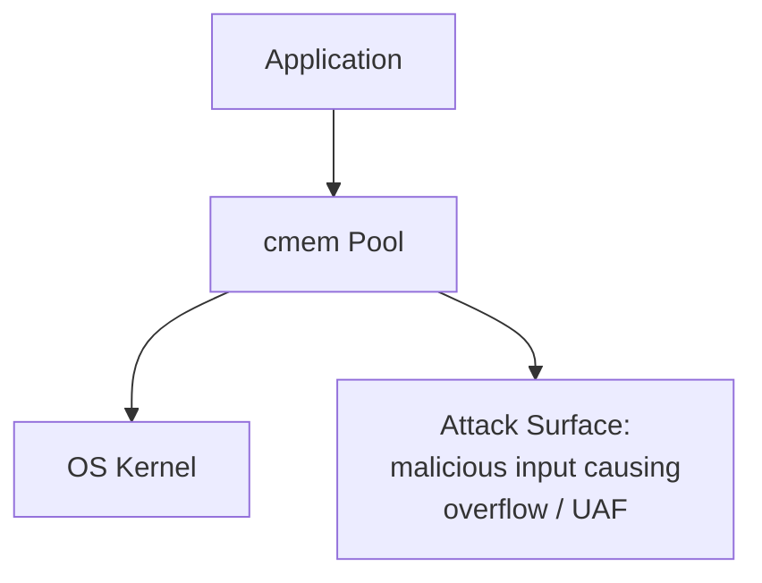

# Security Features Documentation

## Table of Contents

1. [Threat Model](#1-threat-model)
2. [Debug Protections](#2-debug-protections)
3. [Encrypted Memory](#3-encrypted-memory)
4. [ASan Integration](#4-asan-integration)
5. [Security Configuration Examples](#5-security-configuration-examples)
6. [Security Best Practices](#6-security-best-practices)
7. [Compliance](#7-compliance)

---

## 1. Threat Model

### 1.1 Threat Classification

| Threat | Severity | Mitigation |
| :--- | :--- | :--- |
| Buffer Overflow | 🔴 High | Canary, Guard Pages, ASan |
| Use-After-Free | 🔴 High | Poison On Free, ASan |
| Double Free / Wild Pointer | 🟠 Medium-High | Magic verification, ASan |
| Memory Leak | 🟡 Medium | Leak detection, auditing |
| Sensitive Data Leakage | 🔴 High | Encrypted memory, secure zero |
| Side-Channel Attack | 🟡 Medium | Randomization, mlock |
| Denial of Service (OOM) | 🟠 Medium-High | Memory limits, circuit breaker |

### 1.2 Attack Surface



---

## 2. Debug Protections

### 2.1 Canary Out-of-Bounds Detection

**Implementation:**
```c
// Fill canary after payload on allocation
if (pool->flags & MP_FLAG_DEBUG_CANARY) {
    uint8_t* canary = (uint8_t*)ptr + size;
    *canary = MP_CANARY_BYTE;  // 0xAB
}

// Verify canary on free
if (pool->flags & MP_FLAG_DEBUG_CANARY) {
    uint8_t* canary = (uint8_t*)ptr + header->requested_size;
    if (*canary != MP_CANARY_BYTE) {
        // Buffer overflow detected!
        mp_mark_pool_dirty(pool);
    }
}
```

**Overhead:**
- Memory: +1 byte per block
- Performance: ~3% slowdown

### 2.2 UAF Poisoning

**Implementation:**
```c
// Fill with poison bytes on free
if (pool->flags & MP_FLAG_POISON_ON_FREE) {
    memset(ptr, 0xDD, header->usable_size);
}
```

**Effect:**
- After free, access reveals `0xDDDDDDDD` pattern
- Facilitates debugging Use-After-Free

### 2.3 Guard Pages

**Implementation:**
```c
// Set PROT_NONE at page head/tail
if (pool->flags & MP_FLAG_GUARD_PAGES) {
    mprotect(page_addr, page_size, PROT_NONE);
}
```

**Effect:**
- Out-of-bounds access triggers SIGSEGV
- Page alignment waste (+2 pages per block)

### 2.4 Double Free Detection

**Implementation:**
```c
// Block header Magic verification
if (header->magic != MP_MAGIC_HEAD) {
    fprintf(stderr, "[ERROR] Corrupt header or invalid free!\n");
    mp_mark_pool_dirty(pool);
    return;
}
```

---

## 3. Encrypted Memory

### 3.1 mlock Anti-Swap

```c
int mp_lock_memory(memory_pool_t* pool, void* addr, size_t length) {
#ifdef __linux__
    if (mlock(addr, length) != 0) {
        perror("mlock failed");
        return -1;
    }
#endif
    return 0;
}
```

**Security Benefits:**
- Sensitive data is not written to swap partition
- Prevents cold boot attacks

**Limitations:**
- Each process has a lock memory limit (typically 64KB~1GB)
- Requires `CAP_IPC_LOCK` or increased `ulimit -l`

### 3.2 MADV_DONTDUMP Anti-Core-Dump

```c
int mp_protect_from_dump(memory_pool_t* pool, void* addr, size_t length) {
#ifdef __linux__
    if (madvise(addr, length, MADV_DONTDUMP) != 0) {
        perror("madvise failed");
        return -1;
    }
#endif
    return 0;
}
```

**Security Benefits:**
- Sensitive data does not appear in core dump
- Prevents debugger from extracting keys

### 3.3 Secure Zero

```c
void mp_secure_zero(memory_pool_t* pool, void* ptr, size_t length) {
    volatile unsigned char* p = (volatile unsigned char*)ptr;
    while (length--) {
        *p++ = 0;
    }
}
```

**Key Points:**
- Uses `volatile` to prevent compiler optimization
- Ensures the zeroing operation actually executes

### 3.4 Encrypted Memory Mode

```c
// One-click enable encrypted memory
mp_set_encrypted_memory(pool, true);

// Automatically performs on system-allocated memory:
// 1. mlock to lock
// 2. MADV_DONTDUMP to exclude
```

---

## 4. ASan Integration

### 4.1 Detection Capabilities

| Detection Item | ASan | cmem Native | Combined Effect |
| :--- | :--- | :--- | :--- |
| Heap Overflow | ✅ | ✅ | ✅✅ |
| Stack Overflow | ✅ | ❌ | ✅ |
| Global Overflow | ✅ | ❌ | ✅ |
| Use-After-Free | ✅ | ✅ | ✅✅ |
| Double Free | ✅ | ✅ | ✅✅ |
| Memory Leak | ✅ | ✅ | ✅✅ |

### 4.2 Integration Mode

```c
// Enable ASan integration mode
mp_set_asan_integration(pool, true);

// Detect ASan environment
if (mp_asan_is_enabled()) {
    // Adjust strategy for ASan compatibility
}
```

### 4.3 Custom Error Reporting

```c
// After detecting canary corruption, report to ASan
if (*canary != MP_CANARY_BYTE) {
    mp_asan_report_error(pool, ptr, size, true);
}
```

---

## 5. Security Configuration Examples

### 5.1 Maximum Security Level

```c
mp_flags_t flags = MP_FLAG_THREAD_SAFE |
                   MP_FLAG_DEBUG_CANARY |
                   MP_FLAG_POISON_ON_FREE |
                   MP_FLAG_TRACK_LOCATIONS |
                   MP_FLAG_GUARD_PAGES |
                   MP_FLAG_ENCRYPTED_MEMORY |
                   MP_FLAG_ASAN_INTEGRATION;

memory_pool_t* pool = mp_create(64 * 1024 * 1024, flags);
mp_set_memory_limit(pool, 128 * 1024 * 1024);
mp_set_circuit_breaker(pool, true);
mp_set_thread_quota(pool, 8 * 1024 * 1024);
```

**Applicable Scenarios:**
- Security-sensitive applications
- Cryptographic libraries
- Financial trading systems

### 5.2 Balanced Security and Performance

```c
mp_flags_t flags = MP_FLAG_THREAD_SAFE |
                   MP_FLAG_DEBUG_CANARY |
                   MP_FLAG_POISON_ON_FREE;

memory_pool_t* pool = mp_create(64 * 1024 * 1024, flags);
mp_set_memory_limit(pool, 128 * 1024 * 1024);
```

**Applicable Scenarios:**
- Production environment
- Requires some debugging capability

### 5.3 Minimum Security Configuration

```c
mp_flags_t flags = MP_FLAG_THREAD_SAFE;

memory_pool_t* pool = mp_create(64 * 1024 * 1024, flags);
mp_set_memory_limit(pool, 128 * 1024 * 1024);
```

**Applicable Scenarios:**
- Performance-critical paths
- Trusted input environment

---

## 6. Security Best Practices

### 6.1 Development Phase

```c
// Enable all debug features
mp_flags_t flags = MP_FLAG_THREAD_SAFE |
                   MP_FLAG_DEBUG_CANARY |
                   MP_FLAG_POISON_ON_FREE |
                   MP_FLAG_TRACK_LOCATIONS;

memory_pool_t* pool = mp_create(0, flags);

// Regular auditing
bool healthy = mp_audit_heap(pool);
assert(healthy);

// Check for leaks
assert(mp_check_leaks(pool));
```

### 6.2 Production Environment

```c
// Select appropriate security level
mp_flags_t flags = MP_FLAG_THREAD_SAFE |
                   MP_FLAG_DEBUG_CANARY;

memory_pool_t* pool = mp_create(0, flags);

// Set memory limit
mp_set_memory_limit(pool, 512 * 1024 * 1024);

// Enable circuit breaker
mp_set_circuit_breaker(pool, true);
mp_set_thread_quota(pool, 64 * 1024 * 1024);

// Monitor anomalies
mp_set_event_callback(pool, security_event_cb, NULL);
```

### 6.3 Security Event Callback

```c
void security_event_cb(memory_pool_t* pool, mp_event_type_t ev,
                       void* ptr, size_t size, void* user_data) {
    switch (ev) {
        case MP_EVENT_CANARY_CORRUPTION:
            log_security_event("Buffer overflow detected");
            mp_mark_pool_dirty(pool);
            break;
        case MP_EVENT_DOUBLE_FREE:
            log_security_event("Double free detected");
            break;
        case MP_EVENT_OOM:
            log_security_event("Out of memory");
            break;
        default:
            break;
    }
}
```

---

## 7. Compliance

### 7.1 PCI DSS

- Requirement: Encrypted storage of cardholder data
- Implementation: `MP_FLAG_ENCRYPTED_MEMORY` + `mp_secure_zero`

### 7.2 GDPR

- Requirement: Personal data protection
- Implementation: Encrypted memory + secure zeroing + leak detection

### 7.3 HIPAA

- Requirement: Medical data protection
- Implementation: mlock + MADV_DONTDUMP + audit logging

### 7.4 SOC 2

- Requirement: Access control, encryption, auditing
- Implementation: Complete security Flag combination + event callbacks + Prometheus export

---

## Appendix: Security Features Checklist

- [ ] Select appropriate security Flag combination based on scenario
- [ ] Enable `MP_FLAG_TRACK_LOCATIONS` in development environment
- [ ] Enable `MP_FLAG_DEBUG_CANARY` in production environment
- [ ] Enable `MP_FLAG_ENCRYPTED_MEMORY` for sensitive data scenarios
- [ ] Configure `mp_set_memory_limit` to prevent OOM attacks
- [ ] Enable `mp_set_circuit_breaker` to prevent resource exhaustion
- [ ] Register security event callbacks
- [ ] Regularly run `mp_audit_heap` and `mp_check_leaks`
- [ ] Export Prometheus metrics for security monitoring
- [ ] Regular security audits and penetration testing