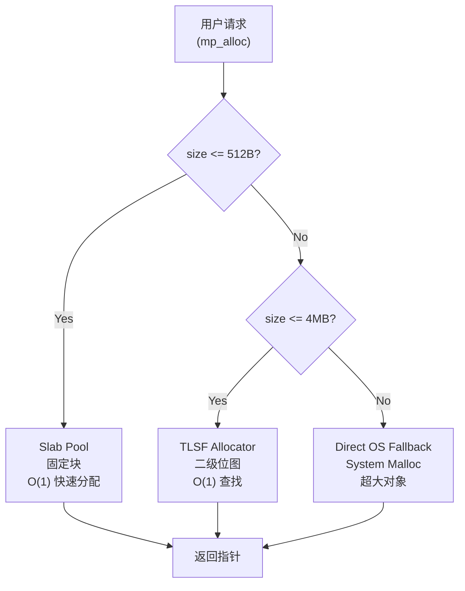
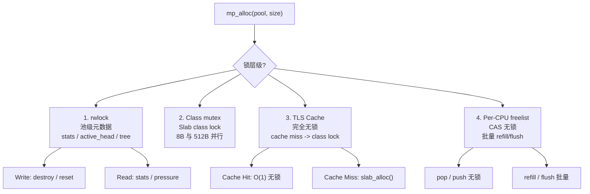
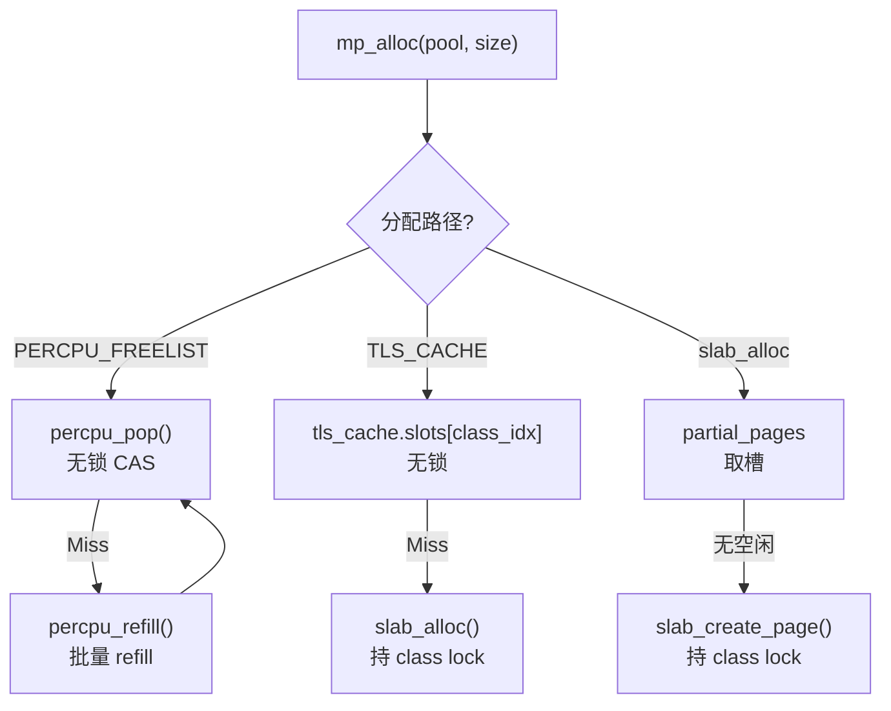
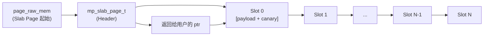
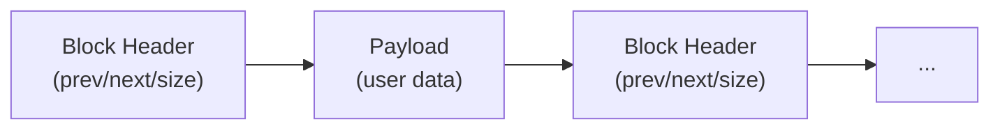
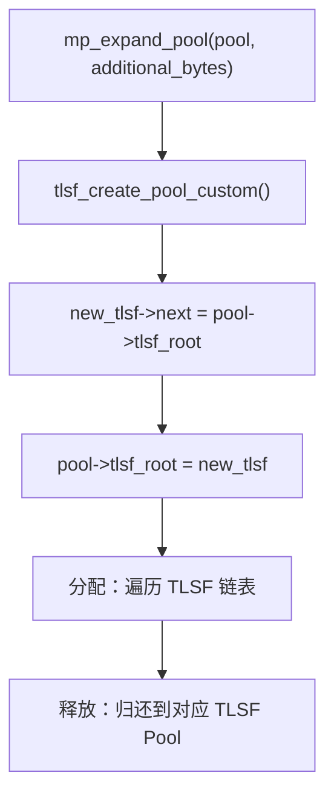

# cmem 架构设计文档

## 1. 系统概述

cmem 是一个通用高性能分层内存管理器，采用 **三层混合架构**（Tiered Hybrid Architecture），在保证 $O(1)$ 分配时间复杂度的同时极大减少内存碎片化，并显著提升 Cache 局部性。

### 1.1 设计目标

- **高性能**：小对象分配/释放达到 $O(1)$ 常数时间
- **低碎片**：通过 Slab + TLSF 混合策略减少内存碎片
- **高并发**：支持多线程安全访问，Per-CPU 无锁快速路径
- **可观测**：内置完整的诊断、监控和泄漏检测能力
- **易集成**：提供 C11、C++17、PMR 多语言接口

### 1.2 核心架构



```text
                           +-------------------------------+
                           |   User Request (mp_alloc)    |
                           +-------------------------------+
                                           |
                    +----------------------+----------------------+
                    | (<= 512 Bytes)       | (512B ~ 4MB)         | (> 4MB)
                    v                      v                      v
           +------------------+   +-------------------+   +--------------------+
           |   Slab Pool      |   |   TLSF Allocator  |   | Direct OS Fallback |
           | (Fixed Blocks)   |   | (Two-Level Fit)   |   |  (System Malloc)   |
           +------------------+   +-------------------+   +--------------------+
           | O(1) Fast Alloc  |   | O(1) Bitmap Search|   | Huge Allocations   |
           | Zero Extra Frag  |   | Immediate Merge   |   | Dynamic Page Track |
           +------------------+   +-------------------+   +--------------------+
            ```

---

## 2. 三层分配器详解

### 2.1 Slab 分配器 (Tier 1: <= 512B)

面向小对象的固定尺寸 Class 分配器，提供 $O(1)$ 分配/释放。

**核心特性：**
- 预定义尺寸类：8B, 16B, 32B, 64B, 128B, 256B, 512B
- 每个 Class 独立锁，减少锁争用
- 支持线程本地缓存（TLS Cache）实现无锁快速路径
- 支持 Per-CPU Lock-Free Freelist 进一步降低并发开销

**数据结构：**

```c
typedef struct mp_slab_page {
    uint8_t class_index;        // 所属 Slab Class 索引
    uint16_t free_count;        // 当前空闲槽位数
    uint16_t total_slots;       // 总槽位数
    mp_slab_slot_t* free_list;  // 空闲槽链表
    struct mp_slab_page* next;  // 链表指针
    struct mp_slab_page* prev;  // 双向链表 prev
    void* page_raw_mem;         // 原始页内存指针
    bool is_hot;                // Hot/Cold 页分离标记
} mp_slab_page_t;

typedef struct {
    size_t slot_size;           // 该 Class 的槽尺寸
    pthread_mutex_t lock;       // 细粒度类锁
    mp_slab_page_t* partial_pages;  // 部分使用的页
    mp_slab_page_t* full_pages;     // 完全占用的页
    mp_slab_page_t* hot_pages;      // 热页链表 (Hot/Cold 分离)
    mp_slab_page_t* cold_pages;     // 冷页链表 (Hot/Cold 分离)
} mp_slab_class_t;
```

**分配流程：**
1. 根据请求尺寸匹配最接近的 Slab Class
2. 优先从 `partial_pages` 链表头部取空闲槽
3. 若无空闲槽，创建新 Slab Page
4. 若启用 TLS Cache，优先从线程本地缓存分配
5. 若启用 Per-CPU Freelist，优先从 per-CPU  freelist 分配

### 2.2 TLSF 分配器 (Tier 2: 512B ~ 4MB)

双层位图索引的可控适合分配器（Two-Level Segregated Fit），提供 $O(1)$ 查找。

**核心特性：**
- 一级位图（FL）：32 个区间，每个区间覆盖特定大小范围
- 二级位图（SL）：每个 FL 对应 64 个 SL，总共 2048 个尺寸类
- 支持原地 Expand（In-Place Expansion），避免 memcpy
- 自动合并相邻空闲块，减少碎片

**数据结构：**

```c
typedef struct tlsf_pool {
    uint32_t fl_bitmap;                    // 一级位图
    uint32_t sl_bitmap[TLSF_FL_MAX];       // 二级位图数组
    tlsf_block_t* blocks[TLSF_FL_MAX][TLSF_SL_COUNT];  // 空闲块矩阵
    void* raw_area;                        // 原始内存区域
    size_t raw_size;                       // 原始内存大小
    struct tlsf_pool* next;                // 链表指针（支持在线扩容）
} tlsf_pool_t;
```

**映射函数：**
```
size -> (fl, sl)
  fl = log2(size) - LOG2_MIN_SIZE
  sl = (size >> (fl + LOG2_MIN_SIZE)) - 1
```

### 2.3 Direct OS Fallback (Tier 3: > 4MB)

超大对象直接回退到系统分配，支持：
- Guard Pages 防护（页首/页尾 PROT_NONE）
- HugePages 加速（2MB/1GB）
- 自定义系统分配器注入

---

## 3. 核心数据结构

### 3.1 内存池主结构

```c
struct memory_pool {
    mp_flags_t flags;                    // 配置标志位
    pthread_rwlock_t rwlock;             // 读写锁（线程安全模式）
    pthread_mutex_t lock;                // 写锁
    char arena_name[64];                 // Arena 名称

    // 父子层级树
    struct memory_pool* parent;          // 父 Arena
    struct memory_pool* first_child;     // 第一个子 Arena
    struct memory_pool* next_sibling;    // 下一个兄弟 Arena

    // 自定义系统分配器
    bool has_custom_sys_alloc;
    mp_sys_allocator_t sys_allocator;

    // 事件回调
    mp_event_callback_t event_cb;
    void* event_user_data;

    // 水位告警
    mp_watermark_callback_t watermark_cb;
    double high_watermark_ratio;
    double low_watermark_ratio;
    bool in_high_watermark_state;
    void* watermark_user_data;

    // NUMA 亲和
    int numa_node;

    // 紧急储备
    void* emergency_buf;
    size_t emergency_size;
    size_t emergency_used;
    bool in_emergency_state;

    // 统计与诊断
    mp_stats_t stats;
    mp_block_header_t* active_head;      // 活跃分配链表
    uint64_t window_alloc_ops;           // 窗口期分配次数
    uint64_t window_alloc_bytes;         // 窗口期分配字节
    struct timespec window_start_time;   // 窗口开始时间

    // Slab 层
    mp_slab_class_t slab_classes[SLAB_CLASS_COUNT];

    // TLSF 层
    tlsf_pool_t* tlsf_root;

    // 运行时增强字段
    uint64_t env_flags_generation;       // 环境配置生成计数
    bool auto_compact_enabled;           // 自动压缩开关
    double auto_compact_pressure_threshold;
    double auto_compact_fragmentation_threshold;
    struct timespec last_auto_compact_time;
    size_t alloc_latency_histogram[32];  // 延迟直方图
    size_t alloc_latency_count;
    uint64_t alloc_latency_sum_ns;
    size_t arena_quota_limit;            // Arena 配额
    mp_watermark_callback_t arena_quota_cb;
    void* arena_quota_user_data;
    int num_cpus;                        // Per-CPU freelist CPU 数
    mp_percpu_freelist_entry_t* percpu_freelists;
    mp_watermark_callback_t gc_cb;       // GC 回调
    void* gc_user_data;
    mp_watermark_callback_t eviction_cb; // 逐出回调
    void* eviction_user_data;
    bool fallback_to_sys_alloc_on_oom;   // OOM 回退开关
    bool is_dirty;                       // 脏池标记
    mp_watermark_callback_t error_recovery_cb;
    void* error_recovery_user_data;
    size_t thread_quota_bytes;           // 线程配额
    bool circuit_breaker_enabled;        // 熔断器开关
    bool circuit_breaker_tripped;        // 熔断器触发状态
    uint32_t abi_version;                // ABI 版本
    bool cgroup_aware;                   // cgroup 感知开关
    size_t cgroup_mem_limit;             // cgroup 内存限制
    bool use_custom_slab_sizes;          // 自定义 Slab 表开关
    size_t custom_slab_sizes[SLAB_CLASS_COUNT]; // 自定义 Slab 尺寸
};
```

### 3.2 块头结构

每个分配块的前置 Header，用于调试、追踪和释放：

```c
typedef struct mp_block_header {
    uint32_t magic;                     // 魔数：MP_MAGIC_HEAD / MP_MAGIC_FREE
    uint8_t alloc_type;                 // 分配类型：SLAB / TLSF / OS
    uint8_t slab_class;                 // Slab Class 索引
    uint8_t flags;                      // 块标志
    uint8_t canary;                     // Canary 字节（调试模式）
    size_t requested_size;              // 用户请求尺寸
    size_t usable_size;                 // 实际可用尺寸
    void* raw_base;                     // 原始基地址
    const char* alloc_file;             // 分配文件（位置追踪）
    int alloc_line;                     // 分配行号
    const char* alloc_func;             // 分配函数
    void* backtrace_addrs[MAX_BACKTRACE_FRAMES];
    int backtrace_depth;
    struct mp_block_header* prev;       // 双向链表
    struct mp_block_header* next;
} mp_block_header_t;
```

### 3.3 线程本地缓存

```c
typedef struct {
    mp_slab_slot_t* slots[SLAB_CLASS_COUNT];  // 每个 Class 的缓存槽
    uint16_t counts[SLAB_CLASS_COUNT];         // 每个 Class 的缓存数量
} thread_cache_t;

static MP_THREAD_LOCAL thread_cache_t tls_cache = {{0}, {0}};
```

---

## 4. 并发控制模型

### 4.1 锁层级策略

cmem 采用 **多层级锁策略**，从粗到细：



1. **读写锁（rwlock）**：保护池级元数据（stats、active_head、树结构）
   - 读锁：内省查询 API（mp_get_stats、mp_pressure 等）
   - 写锁：生命周期操作（mp_destroy、mp_reset）

2. **细粒度 Slab Class 锁**：每个 Slab Class 独立的 `pthread_mutex_t`
   - 不同尺寸的小对象分配互不干扰
   - 8B 和 512B 的分配可完全并行

3. **线程本地缓存（TLS Cache）**：完全无锁
   - 小对象分配优先走 TLS Cache
   - 仅在 Cache Miss 时回退到带锁路径

4. **Per-CPU Lock-Free Freelist**（可选）
   - 基于 CAS 的 per-CPU freelist
   - 完全无锁，无伪共享
   - 批量 Refill/Flush 机制保持内存利用率

### 4.2 无锁路径



```
mp_alloc(pool, size)
  ├─ [PERCPU_FREELIST] -> percpu_pop() [无锁 CAS]
  │     └─ Miss -> percpu_refill() -> percpu_pop()
  ├─ [TLS_CACHE] -> tls_cache.slots[class_idx] [无锁]
  │     └─ Miss -> slab_alloc() [持 class lock]
  └─ [slab_alloc] -> partial_pages 取槽
        └─ 无空闲 -> slab_create_page() [持 class lock]
  ```

---

## 5. 内存布局

### 5.1 Slab Page 布局



```
+------------------+----------------------------------------------+
| mp_slab_page_t   |  Slot 0 | Slot 1 | ... | Slot N-1 | Slot N |
| (Header)         |  [payload+canary]                           |
+------------------+----------------------------------------------+
 ^                  ^
 |                  |
 page_raw_mem       槽起始地址（返回给用户的 ptr）
```

- `page_raw_mem` 指向整个 Slab Page 的起始
- 用户返回的 `ptr` = `page_raw_mem + sizeof(mp_slab_page_t) + slot_index * slot_size`
- Canary 字节位于 `ptr + requested_size`（调试模式）

### 5.2 TLSF Block 布局



- Block Header 位于 payload 前
- 空闲块通过二级位图管理
- 物理相邻块通过 `prev_physical` 双向链接

---

## 6. 扩展机制

### 6.1 在线扩容

通过 TLSF Pool 链表实现无停服扩容：



```c
struct memory_pool {
    tlsf_pool_t* tlsf_root;  // 链表头
    // ...
};

bool mp_expand_pool(memory_pool_t* pool, size_t additional_bytes) {
    tlsf_pool_t* new_tlsf = tlsf_create_pool_custom(pool, additional_bytes, NULL);
    new_tlsf->next = pool->tlsf_root;  // 插入链表头部
    pool->tlsf_root = new_tlsf;
    return true;
}
```

分配时遍历整个 TLSF 链表查找合适块，释放时归还到对应 TLSF Pool。

### 6.2 自定义系统分配器

```c
typedef struct {
    void* (*sys_alloc)(size_t size, void* user_data);
    void  (*sys_free)(void* ptr, size_t size, void* user_data);
    void* user_data;
} mp_sys_allocator_t;
```

允许注入 HugeTLB、Shared Memory、NUMA 等特殊后端。

### 6.3 事件回调钩子

```c
typedef void (*mp_event_callback_t)(memory_pool_t* pool,
                                    mp_event_type_t ev,
                                    void* ptr,
                                    size_t size,
                                    void* user_data);
```

支持的事件类型：
- `MP_EVENT_ALLOC` / `MP_EVENT_FREE` / `MP_EVENT_REALLOC`
- `MP_EVENT_OOM` / `MP_EVENT_RESET` / `MP_EVENT_COMPACT`
- `MP_EVENT_CANARY_CORRUPTION` / `MP_EVENT_DOUBLE_FREE`

---

## 7. 诊断与可观测性

### 7.1 统计指标

```c
typedef struct {
    size_t total_pool_size;       // 系统保留总字节
    size_t active_bytes;          // 当前活跃 payload 字节
    size_t peak_bytes;            // 峰值活跃字节
    size_t max_memory_limit;      // 内存上限（0=无限）
    size_t active_allocations;    // 当前活跃分配数
    size_t total_alloc_ops;       // 累计分配次数
    size_t total_free_ops;        // 累计释放次数
    size_t slab_allocated_bytes;  // Slab 层 payload 字节
    size_t tlsf_allocated_bytes;  // TLSF 层 payload 字节
    size_t os_allocated_bytes;    // OS 层 payload 字节
    double fragmentation_ratio;   // 碎片率 [0.0, 1.0]
    double alloc_qps;             // 实时分配 QPS
    double bandwidth_mbps;        // 实时带宽 MB/s
    size_t size_histogram[CMEM_HISTOGRAM_BUCKETS]; // 尺寸分布直方图
} mp_stats_t;
```

### 7.2 泄漏检测

- **活跃链表追踪**：每次分配/释放维护 `active_head` 双向链表
- **Magic Canary**：块头魔数 + 尾字节校验
- **Backtrace 记录**：可选记录调用栈（`MP_FLAG_TRACK_LOCATIONS`）
- **HTML 报告**：可视化泄漏卡片和调用栈
- **二进制快照 Diff**：两次快照对比，增量泄漏分析

### 7.3 延迟追踪

```c
size_t alloc_latency_histogram[32];  // 对数桶直方图
size_t alloc_latency_count;          // 样本总数
uint64_t alloc_latency_sum_ns;       // 总延迟（纳秒）
```

支持 P99、P50、平均延迟统计。

### 7.4 诊断 CLI 工具

仓库在 `tools/` 下提供两个诊断 CLI：

- `tools/cmem-inspect` — 链接 `libcmem`，用于实时进程内诊断：
  - 子命令：`leaks`、`audit`、`stats`、`tree`、`histogram`、`snapshot`、`diff`、`html`
  - 支持 `--json`、`--output <path>`、`--quiet`
- `tools/cmem-analyze` — 独立离线分析器，解析 `.cmem_dump` 二进制快照：
  - 子命令：`report`、`top`、`summary`、`validate`、`diff`
  - 支持 `--json`、`--html`、`--output <path>`、`--quiet`、`--top <n>`

构建方式：`make tools`

---

## 8. 安全特性

### 8.1 调试防护

| 特性 | 实现方式 | 开销 |
| :--- | :--- | :--- |
| Canary 越界检测 | 尾字节填充 0xAB，free 时校验 | 每块 +1 字节 |
| UAF 毒化 | free 后填充 0xDD | 无额外内存 |
| Guard Pages | 页首/页尾 mprotect(PROT_NONE) | 每块 +2 页 |
| 双 Free 检测 | 块头 Magic 校验 | 无额外内存 |
| 溢出安全检查 | `nmemb * size > SIZE_MAX` | 无额外内存 |

### 8.2 加密内存

- `mlock()`：防止敏感数据被 swap 到磁盘
- `madvise(MADV_DONTDUMP)`：排除内存免于 core dump
- `mp_secure_zero()`：volatile 安全清零

### 8.3 ASan 集成

- `mp_asan_is_enabled()`：检测 ASan 环境
- `mp_asan_report_error()`：自定义错误报告
- `mp_set_asan_integration()`：启用 ASan 兼容模式

---

## 9. C++ 接口设计

### 9.1 RAII 包装

```cpp
namespace cmem {
class MemoryPool {
public:
    explicit MemoryPool(size_t capacity, mp_flags_t flags);
    ~MemoryPool();
    void* alloc(size_t size);
    void free(void* ptr);
    // ... 完整 API 映射
    memory_pool_t* get();  // 获取底层 C 指针
};
}
```

### 9.2 STL 分配器

```cpp
template<typename T>
class allocator {
public:
    using value_type = T;
    allocator(memory_pool_t* pool);
    T* allocate(std::size_t n);
    void deallocate(T* p, std::size_t n);
};
```

### 9.3 PMR 适配

```cpp
class pmr_resource : public std::pmr::memory_resource {
protected:
    void* do_allocate(std::size_t bytes, std::size_t alignment) override;
    void do_deallocate(void* p, std::size_t bytes, std::size_t alignment) override;
    bool do_is_equal(const std::pmr::memory_resource& other) const noexcept override;
};
```

---

## 10. 性能优化策略

### 10.1 Cache 友好设计

- Slab 固定尺寸保证同一 Class 的所有块大小相同
- 连续 Slab Page 分配提升 TLB 命中率
- Hot/Cold 页分离将热数据集中存放

### 10.2 批量操作

- `mp_alloc_batch` / `mp_free_batch`：减少锁获取次数
- Frame Arena：O(1) 帧级批量重置

### 10.3 内存回收策略

- `mp_compact`：释放完全空闲的 Slab Page
- `mp_purge_lazy`：madvise(MADV_DONTNEED) 延迟回收
- `mp_trim`：组合 compact + purge 最大程度回收
- 自动压缩触发（基于压力/碎片率阈值）

---

## 11. 可扩展性设计

### 11.1 插件化 Backend

通过 `mp_sys_allocator_t` 支持自定义后端：
- HugePages 后端
- Shared Memory 后端
- NUMA 绑定后端
- 未来可扩展 RDMA / 网络内存后端

### 11.2 ABI 版本管理

```c
uint32_t mp_abi_version(void);  // 当前返回 1
```

向前兼容策略：
- 新增字段仅在结构体末尾追加
- 提供 ABI 版本查询接口
- 旧版本客户端检测到新版本时降级功能

### 11.3 容器感知

自动读取 cgroup 内存限制：
- `/sys/fs/cgroup/memory/memory.limit_in_bytes` (cgroup v1)
- `/sys/fs/cgroup/memory.max` (cgroup v2)

**相关 API：**
- `mp_set_cgroup_aware(pool, enable)`：启用或禁用 cgroup 感知
- `mp_get_cgroup_mem_limit(pool)`：获取检测到的 cgroup 内存限制

### 11.4 内存错误恢复

cmem 提供了一套机制来应对内存损坏（如 Canary 越界或双重释放）：
- **脏池标记**：一旦检测到损坏，内存池会被标记为"脏"，后续分配请求将被拒绝以防止进一步损坏
- **坏块隔离**：支持将检测到的损坏块从活跃追踪链表中移除，实现逻辑隔离

**相关 API：**
- `mp_mark_pool_dirty(pool)` / `mp_clear_pool_dirty(pool)`
- `mp_is_pool_dirty(pool)`
- `mp_set_error_recovery_callback(pool, cb, udata)`
- `mp_isolate_bad_block(pool, ptr)`

### 11.5 线程配额与熔断器

为了防止单个线程耗尽整个内存池，cmem 引入了线程级配额管理：
- **线程配额**：限制每个线程可分配的最大字节数
- **熔断器**：当线程超过配额时，熔断器触发并拒绝该线程的后续分配请求

**相关 API：**
- `mp_set_thread_quota(pool, quota_bytes)`
- `mp_set_circuit_breaker(pool, enable)`
- `mp_is_circuit_breaker_tripped(pool)`
- `mp_get_thread_allocated_bytes(pool)`
- `mp_reset_thread_quota(pool)`

---

## 12. 未来演进方向

1. **语言绑定**：Python / Rust / Go 绑定
2. **分布式内存池**：RDMA / 网络透明内存
3. **更激进的 Lock-Free**：SEQLOCK / Hazard Pointer
4. **压缩存储**：透明内存压缩
5. **NUMA 自动优化**：自动检测并绑定 NUMA 节点
6. **硬件辅助**：Intel MPK / ARM MTE 集成
