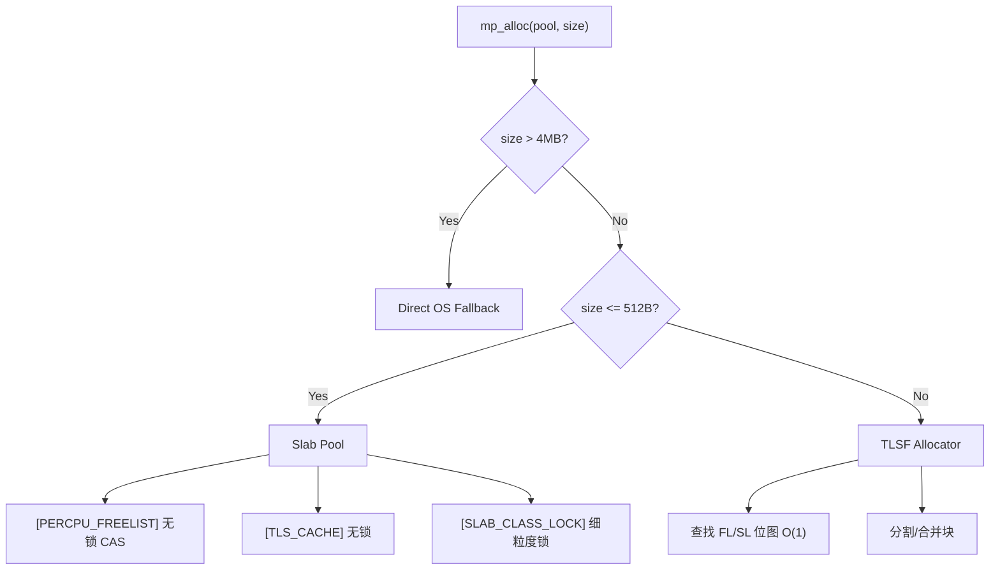

# 性能调优指南

## 目录

1. [性能模型](#1-性能模型)
2. [池大小调优](#2-池大小调优)
3. [Flag 选择策略](#3-flag-选择策略)
4. [Slab Class 调优](#4-slab-class-调优)
5. [并发优化](#5-并发优化)
6. [内存回收策略](#6-内存回收策略)
7. [NUMA 优化](#7-numa-优化)
8. [HugePages 优化](#8-hugepages-优化)
9. [监控指标](#9-监控指标)
10. [性能陷阱](#10-性能陷阱)

---

## 1. 性能模型

cmem 采用三层混合架构，每层的性能特征不同：

| 层级 | 尺寸范围 | 分配复杂度 | 典型吞吐 | 适用场景 |
| :--- | :--- | :--- | :--- | :--- |
| Slab | <= 512B | O(1) | ~1.8 Gops/sec | 小对象、高频分配 |
| TLSF | 512B ~ 4MB | O(1) | ~400 Mops/sec | 中对象、变长分配 |
| OS Fallback | > 4MB | O(n) | ~50 Mops/sec | 大对象、低频分配 |

### 1.1 分配路径



---

## 2. 池大小调优

### 2.1 初始容量选择

```c
// 自动计算（推荐）
memory_pool_t* pool = mp_create(0, MP_FLAG_DEFAULT);

// 手动指定
memory_pool_t* pool = mp_create(64 * 1024 * 1024, MP_FLAG_DEFAULT);  // 64MB
```

**建议：**
- 小型应用（< 1GB 内存）：`0`（自动）或 `16MB`
- 中型应用（1GB~8GB）：`64MB` ~ `256MB`
- 大型应用（> 8GB）：`256MB` ~ `1GB`

### 2.2 在线扩容

```c
// 监控可扩容空间
size_t expandable = mp_get_expandable_size(pool);

// 动态扩容
if (expandable < 64 * 1024 * 1024) {  // 剩余 < 64MB
    mp_expand_pool(pool, 64 * 1024 * 1024);  // 追加 64MB
}
```

### 2.3 内存限制

```c
// 设置硬上限
mp_set_memory_limit(pool, 512 * 1024 * 1024);  // 512MB

// 配合水位回调
mp_set_watermark_callback(pool, 0.8, 0.5, watermark_cb, NULL);
```

---

## 3. Flag 选择策略

### 3.1 生产环境推荐

```c
// 通用生产环境
mp_flags_t flags = MP_FLAG_THREAD_SAFE | MP_FLAG_THREAD_LOCAL_CACHE;

// 高并发场景
mp_flags_t flags = MP_FLAG_THREAD_SAFE | MP_FLAG_PERCPU_FREELIST;

// 安全敏感场景
mp_flags_t flags = MP_FLAG_THREAD_SAFE | MP_FLAG_DEBUG_CANARY |
                   MP_FLAG_POISON_ON_FREE | MP_FLAG_ENCRYPTED_MEMORY;

// 大内存/低延迟场景
mp_flags_t flags = MP_FLAG_THREAD_SAFE | MP_FLAG_HUGE_PAGES |
                   MP_FLAG_HOT_COLD_SEPARATION;
```

### 3.2 Flag 开销对比

| Flag | 内存开销 | 性能开销 | 推荐场景 |
| :--- | :--- | :--- | :--- |
| `MP_FLAG_THREAD_SAFE` | 无 | ~5-10% | 多线程必选 |
| `MP_FLAG_THREAD_LOCAL_CACHE` | 每线程 ~1KB | < 1% | 高频小对象 |
| `MP_FLAG_PERCPU_FREELIST` | 每 CPU 每 Class ~16 槽 | < 2% | 高并发小对象 |
| `MP_FLAG_DEBUG_CANARY` | 每块 +1B | ~3% | 开发/调试 |
| `MP_FLAG_TRACK_LOCATIONS` | 每块 ~80B | ~5% | 泄漏分析 |
| `MP_FLAG_POISON_ON_FREE` | 无 | < 1% | UAF 检测 |
| `MP_FLAG_CACHE_ALIGNED` | 可能浪费 | < 1% | 高性能场景 |
| `MP_FLAG_GUARD_PAGES` | 每块 +2 页 | ~2-5% | 调试/安全 |
| `MP_FLAG_HUGE_PAGES` | 无 | ~1% | 大内存 |
| `MP_FLAG_ENCRYPTED_MEMORY` | 无 | ~2-3% | 安全敏感 |
| `MP_FLAG_ASAN_INTEGRATION` | 无 | 编译时决定 | ASan 环境 |

---

## 4. Slab Class 调优

### 4.1 默认 Class 表

```c
static const size_t kSlabSizes[SLAB_CLASS_COUNT] = {
    8, 16, 32, 64, 128, 256, 512
};
```

### 4.2 自定义 Class 表

```c
// 针对特定工作负载优化
size_t custom_sizes[] = {16, 32, 64, 128, 256, 512, 1024};
mp_set_slab_classes(pool, custom_sizes, 7);
```

**建议：**
- 根据实际分配尺寸分布调整
- 避免过多尺寸类（建议 <= 16）
- 保持尺寸类为 2 的幂次

### 4.3 监控尺寸分布

```c
mp_dump_histogram(pool);
```

**输出示例：**
```
Bucket 0  [1 B - 2 B    ] : 10
Bucket 1  [3 B - 4 B    ] : 5
Bucket 3  [9 B - 16 B   ] : 50   <-- 集中在 16B
Bucket 5  [33 B - 64 B  ] : 20
```

根据分布调整 Slab Class。

---

## 5. 并发优化

### 5.1 TLS Cache vs Per-CPU Freelist

| 特性 | TLS Cache | Per-CPU Freelist |
| :--- | :--- | :--- |
| 实现复杂度 | 简单 | 中等 |
| 内存开销 | 每线程 ~1KB | 每 CPU 每 Class ~256B |
| 锁争用 | 低 | 无 |
| Cache 友好度 | 高 | 中 |
| 适用场景 | 通用 | 高并发小对象 |

### 5.2 推荐配置

```c
// 通用多线程
MP_FLAG_THREAD_SAFE | MP_FLAG_THREAD_LOCAL_CACHE

// 高并发（> 8 线程，小对象为主）
MP_FLAG_THREAD_SAFE | MP_FLAG_PERCPU_FREELIST
```

### 5.3 批量操作

```c
// 减少锁获取次数
void* ptrs[100];
size_t n = mp_alloc_batch(pool, 64, ptrs, 100);
// ... 使用 ptrs ...
mp_free_batch(pool, ptrs, n);
```

### 5.4 Frame Arena

```c
// 游戏/渲染管线：O(1) 批量重置
cmem_frame_arena_t* farena = mp_frame_arena_create(512 * 1024);

// Frame 1
void* p1 = mp_frame_alloc(farena, 1024);
// ... 使用 p1 ...
mp_frame_end(farena);  // O(1) 重置

// Frame 2
void* p2 = mp_frame_alloc(farena, 2048);
// ... 使用 p2 ...
mp_frame_end(farena);
```

---

## 6. 内存回收策略

### 6.1 自动压缩

```c
// 配置自动压缩
mp_set_auto_compact(pool, true, 0.8, 0.3);
// 压力 > 80% 或 碎片率 > 30% 时触发
```

### 6.2 手动回收

```c
// 完整回收流程
size_t freed = mp_trim(pool, 0);  // 深度回收
printf("Reclaimed %zu bytes\n", freed);
```

### 6.3 延迟回收

```c
// 仅回收 RSS，不释放页
size_t purged = mp_purge_lazy(pool);
```

### 6.4 回收策略对比

| 策略 | 操作 | 性能 | 回收率 |
| :--- | :--- | :--- | :--- |
| `mp_compact` | 释放空闲 Page | 中等 | 高 |
| `mp_purge_lazy` | madvise(DONTNEED) | 低 | 中 |
| `mp_trim` | compact + purge | 高 | 最高 |

---

## 7. NUMA 优化

### 7.1 NUMA 绑定

```c
// 绑定到 NUMA 节点 0
mp_set_numa_node(pool, 0);
```

### 7.2 检测 NUMA 拓扑

```bash
# 查看 NUMA 拓扑
numactl --hardware

# 查看内存分配策略
numastat
```

### 7.3 多节点场景

```c
// 为每个 NUMA 节点创建独立池
for (int node = 0; node < numa_max_node(); node++) {
    memory_pool_t* node_pool = mp_create(64*1024*1024, MP_FLAG_THREAD_SAFE);
    mp_set_numa_node(node_pool, node);
    // 将 node_pool 分配给该节点上的线程
}
```

---

## 8. HugePages 优化

### 8.1 启用 HugePages

```c
mp_flags_t flags = MP_FLAG_HUGE_PAGES;
memory_pool_t* pool = mp_create(256 * 1024 * 1024, flags);
```

### 8.2 系统配置

```bash
# 查看 HugePages 配置
cat /proc/meminfo | grep HugePages

# 预留 HugePages
echo 1024 | sudo tee /proc/sys/vm/nr_hugepages

# 挂载 hugetlbfs
sudo mount -t hugetlbfs nodev /dev/hugepages
```

### 8.3 适用场景

- 内存池 > 1GB
- 减少 TLB Miss
- 大内存工作负载（数据库、缓存）

---

## 9. 监控指标

### 9.1 关键指标

```c
mp_stats_t stats;
mp_get_stats(pool, &stats);

// 内存使用
printf("Active: %.2f MB\n", stats.active_bytes / 1024.0 / 1024.0);
printf("Peak: %.2f MB\n", stats.peak_bytes / 1024.0 / 1024.0);
printf("Pressure: %.2f%%\n", mp_pressure(pool) * 100);

// 吞吐量
printf("QPS: %.2f\n", stats.alloc_qps);
printf("Bandwidth: %.2f MB/s\n", stats.bandwidth_mbps);

// 碎片
printf("Fragmentation: %.2f%%\n", stats.fragmentation_ratio * 100);

// 延迟
printf("P99 Latency: %zu ns\n", mp_get_latency_p99(pool));
printf("Avg Latency: %zu ns\n", mp_get_latency_avg(pool));
```

### 9.2 Prometheus 指标

```c
char buf[4096];
mp_export_prometheus_metrics(pool, buf, sizeof(buf));
// 暴露给 Prometheus 抓取
```

### 9.3 JSON 遥测

```c
char buf[4096];
mp_dump_json_stats(pool, buf, sizeof(buf));
// 发送到监控系统
```

---

## 10. 性能陷阱

### 10.1 常见错误

| 错误 | 影响 | 解决方案 |
| :--- | :--- | :--- |
| 池过小 | 频繁 OS 分配 | 增加初始容量或启用扩容 |
| 无 TLS Cache | 高并发锁争用 | 启用 `MP_FLAG_THREAD_LOCAL_CACHE` |
| 过度使用 Guard Pages | 地址空间浪费 | 仅调试时启用 |
| 未调用 `mp_trim` | RSS 不释放 | 定期调用或启用自动压缩 |
| 大对象走 Slab | 内存浪费 | 确保尺寸阈值正确 |

### 10.2 性能排查流程

```c
// 1. 检查碎片率
double frag = mp_pressure(pool);
if (frag > 0.5) {
    printf("High fragmentation: %.2f\n", frag);
}

// 2. 检查可回收内存
size_t freeable = mp_freeable(pool);
if (freeable > 1024 * 1024) {
    printf("Consider mp_trim: %zu bytes freeable\n", freeable);
}

// 3. 检查尺寸分布
mp_dump_histogram(pool);

// 4. 检查延迟
uint64_t p99 = mp_get_latency_p99(pool);
if (p99 > 1000000) {  // > 1ms
    printf("High P99 latency: %zu ns\n", p99);
}
```

### 10.3 基准测试建议

```bash
# 1. 建立性能基线
make bench > baseline.txt

# 2. 每次变更后对比
make bench > after_change.txt

# 3. 使用 perf 分析热点
perf record -g ./build/benchmark
perf report
```

---

## 附录：性能调优 checklist

- [ ] 根据工作负载选择合适的初始容量
- [ ] 启用 `MP_FLAG_THREAD_LOCAL_CACHE` 或 `MP_FLAG_PERCPU_FREELIST`
- [ ] 配置 `mp_set_auto_compact` 自动回收
- [ ] 定期调用 `mp_trim` 或 `mp_purge_lazy`
- [ ] 监控 `fragmentation_ratio` 和 `pressure`
- [ ] 使用 `mp_dump_histogram` 分析尺寸分布
- [ ] 大内存场景启用 `MP_FLAG_HUGE_PAGES`
- [ ] NUMA 系统绑定到正确节点
- [ ] 生产环境禁用调试 Flag
- [ ] 定期运行基准测试建立性能基线
